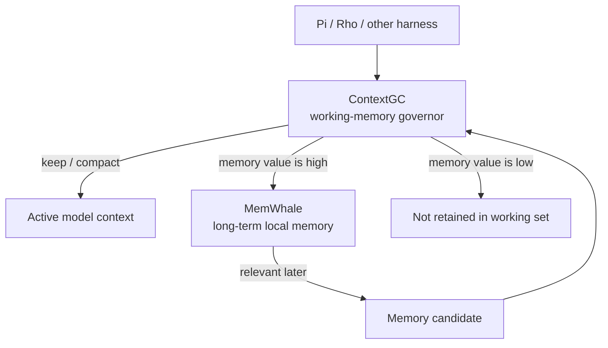

# ContextGC + MemWhale

ContextGC and [MemWhale](https://github.com/wuisabel-gif/MemWhale) are complementary systems and should remain separate projects.

> **ContextGC manages what stays in an agent's context. MemWhale preserves what is worth remembering after it leaves.**

## Responsibilities

| System | Question it answers |
|---|---|
| ContextGC | What should the model know right now? |
| MemWhale | What happened before, and what might be useful again? |

ContextGC owns the active working set: pressure prediction, token budgets,
importance, recoverability, compression, and eviction. MemWhale owns optional
long-term local memory: searchable debugging history, successful fixes, command
outcomes, and other durable records.



## Lifecycle

```text
ACTIVE CONTEXT
      │ becomes less relevant
      ▼
  ContextGC
      │ selectively compact
      ▼
  memory value?
    /       \
  high      low
   │         │
   ▼         X
MemWhale   discard
   │
   │ relevant later
   ▼
ContextGC retrieval
   │
   ▼
working context
```

Not everything evicted from active context should become long-term memory. A
30,000-token successful log usually has low memory value; a novel successful
fix or architecture decision may have high memory value.

| Item | Active-context value | Long-term-memory value |
|---|---:|---:|
| Current compiler error | high | medium |
| Explicit user constraint | very high | high |
| Successful novel fix | medium | very high |
| Successful raw build log | low | very low |
| Old source file contents | low | low |
| Architecture decision | high | very high |
| Failed random experiment | low | low/medium |

## Backend boundary

The reusable interface lives in `crates/contextgc-memory`. It does not import
MemWhale or `memorywhale-core`:

```rust
#[async_trait]
pub trait MemoryBackend: Send + Sync {
    async fn store(
        &self,
        item: ExternalizedContext,
    ) -> Result<MemoryRef, MemoryError>;

    async fn retrieve(
        &self,
        query: RetrievalQuery,
    ) -> Result<Vec<MemoryCandidate>, MemoryError>;

    async fn get(
        &self,
        reference: &MemoryRef,
    ) -> Result<Option<StoredContext>, MemoryError>;
}
```

This keeps `contextgc-core` independent while allowing implementations such as:

- `NullMemoryBackend` — default no-op backend.
- filesystem storage — simple local artifacts.
- SQLite memory — local structured records.
- MemWhale — MCP-backed persistent debugging memory.

## MemWhale over MCP

The first integration path should be MCP rather than a Rust dependency:

```text
ContextGC ──MCP/stdio──> mw-mcp ──> MemWhale SQLite memory
```

That lets each project evolve independently and keeps the boundary usable from
Rust, TypeScript, Python, Pi, Rho, and other harnesses.

A future configuration can look like:

```toml
[memory]
backend = "memwhale"
store_externalized = true
store_checkpoints = true
store_errors = true
store_successful_fixes = true
store_raw_logs = false

[memory.memwhale]
transport = "stdio"
command = "mw-mcp"
```

The corresponding ContextGC configuration fields already exist, while the
MCP process adapter is intentionally kept outside `contextgc-core`.

## Promotion back into context

When a new problem appears, ContextGC can issue a retrieval query only when
active context does not contain a sufficient explanation. A relevant MemWhale
candidate is then scored like any other incoming context object before it is
promoted into the working set.

```text
current problem
      │
      ▼
active context has no relevant explanation
      │
      ▼
MemWhale search: "authentication middleware session id"
      │
      ▼
rank memory candidates by relevance and memory provenance
      │
      ▼
promote selected candidate into ContextGC working context
```

Retrieval should be selective. Automatically dumping all persistent memory
back into every model prompt would recreate the same context-pressure problem
ContextGC is designed to solve.
