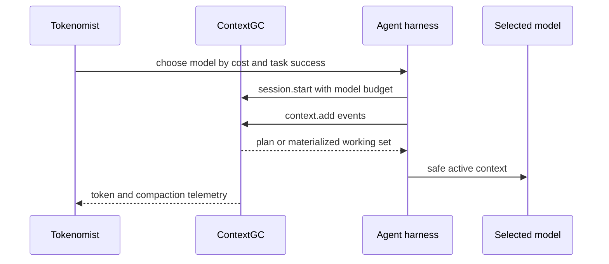

# ContextGC + Tokenomist

[Tokenomist](https://github.com/wuisabel-gif/Tokenomist) and ContextGC solve
adjacent parts of the agent lifecycle.

> **Tokenomist decides which model or agent is worth using. ContextGC decides
> what that selected model should see right now.**

Tokenomist benchmarks agents on real tasks, ranks them by cost per correct
solution, and routes future work to the cheapest model that can handle it.
ContextGC manages the selected agent's context working set as the session grows.

## Clean boundary

| System | Responsibility |
|---|---|
| Tokenomist | Model/agent selection, benchmarking, cost-aware routing |
| ContextGC | Context pressure, token budget, selective compaction, active working set |
| MemWhale | Optional durable memory after context leaves the working set |

Neither project needs to import the other. Tokenomist can supply model metadata
such as `context_window` and `reserved_output_tokens`; ContextGC can return
pressure, active-token, reclaimed-token, and compaction telemetry through its
JSONL protocol.



## Suggested lifecycle

```text
Tokenomist selects a capable, cost-effective model
                         │
                         ▼
              ContextGC receives model budget
                         │
                         ▼
       ContextGC materializes the active working set
                         │
                         ▼
                agent calls the selected model
                         │
                         ▼
     ContextGC reports actual tokens and pressure outcomes
                         │
                         ▼
       Tokenomist improves future routing decisions
```

This creates a useful feedback loop without turning either project into a
monolith:

- Tokenomist learns the cost of a task under real context conditions.
- ContextGC learns the selected model's context behavior and output patterns.
- The harness remains free to switch models when routing changes.

## Protocol handoff

A routing layer can start a ContextGC session with the selected model's budget:

```json
{"type":"session.start","request_id":"1","session_id":"coding","model":{"name":"selected-model","context_window":200000,"reserved_output_tokens":16000}}
```

The harness then streams context events and requests a working set before model
calls:

```json
{"type":"context.add","request_id":"2","item":{"kind":"UserMessage","content":"Fix the authentication middleware."}}
{"type":"context.plan","request_id":"3","predicted_extra_tokens":30000}
{"type":"context.materialize","request_id":"4"}
```

The boundary stays language-neutral and works for Rust, TypeScript, Python,
Pi, Rho, and custom harnesses.

## Together with MemWhale

The three-project relationship is:

```text
Tokenomist
  selects the model/agent
       │
       ▼
ContextGC
  manages active context
       │
       ├── keep / compact → selected model
       │
       └── memory value is high → MemWhale
                                  persistent local memory
```

Read the [MemWhale integration guide](memwhale-integration.md) for the
long-term-memory boundary. See the [Tokenomist repository](https://github.com/wuisabel-gif/Tokenomist) for benchmarking and routing.
